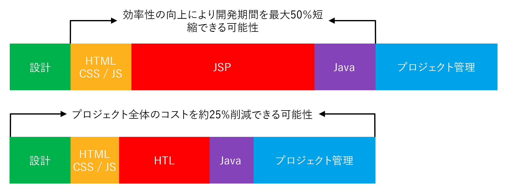

# 概要 {#overview}

Adobe Experience Mananger（AEM）でサポートされている HTML テンプレート言語（HTL）の目的は、セキュリティの向上につながる高度に生産的なエンタープライズレベルの Web フレームワークを提供し、Java の知識のない HTML 開発者が AEM プロジェクトに参加できるようにすることです。

HTML テンプレート言語は AEM 6.0 で導入され、JSP（JavaServer Pages）に代わって推奨される HTML 用のサーバー側テンプレートシステムです。堅牢なエンタープライズ Web サイトを構築しなければならない Web 開発者にとって、HTL は安全性と開発効率の向上に役立ちます。

## セキュリティの向上 {#increased-security}

HTML テンプレート言語はプレゼンテーションレイヤーに出力されるすべての変数に対してコンテキスト認識型の適切なエスケープを自動的に適用できるため、JSP やその他大多数のテンプレートシステムと比較して、HTL が実装されたサイトはセキュリティが向上します。その理由は、HTL が HTML 構文を理解し、マークアップ内の位置に基づいて式に対して必要なエスケープを調整できるからです。これにより、例えば `href` 属性または `src` 属性に配置された式が、その他の属性に配置された式とは別にエスケープされたりします。

JSP のようなテンプレート言語でもこれと同じ結果が得られますが、開発者は各変数に対してエスケープが適切に適用されたかどうかを手動で確認する必要があります。エスケープが 1 つ省略または間違って適用されるだけでクロスサイトスクリプティング（XSS）の脆弱性を引き起こす危険性があるので、このタスクを HTL で自動化することにしました。開発者は必要に応じて表現に対して別のエスケープを指定することもできますが、HTL のデフォルトの動作のほうが目的の動作に対応する可能性が高く、エラーの発生確率を減らすことができます。

## 開発の簡略化 {#simplified-development}

HTML テンプレート言語は学習が容易であり、機能が意図的に制限されているため、複雑さがなく常にシンプルです。また、マークアップを構成してロジックを呼び出すための強力なメカニズムが用意されている一方で、マークアップとロジックの間で常に関心事の分離が厳密に行われています。HTL 自体は標準の HTML5 であり、表現やデータ属性を使用して目的の動的動作の注釈をマークアップに追加します。つまり、マークアップを無効にすることなく、読み取り可能なままにします。表現やデータ属性の評価はすべてサーバー側で実行され、クライアント側には表示されないため、目的の JavaScript フレームワークを干渉なしに使用できます。

これらの機能により、Java の知識がなく、HTL テンプレートを編集する製品固有の知識がほとんどない HTML 開発者でも開発チームに参加し、Java のフルスタック開発者とのコラボレーションを効率化できます。その逆に、これにより Java 開発者は HTML について心配することなく、バックエンドのコードに集中できます。

## コストの削減 {#reduced-costs}

セキュリティの向上、開発の簡略化、チームコラボレーションの促進により、AEM プロジェクトの負荷軽減、市場投入までの時間（TTM）短縮、総所有コスト（TCO）の削減を実現します。

具体的には、Adobe.com のサイトを HTML テンプレート言語で再実装すると、プロジェクトのコストと期間を約 25％削減できることがわかっています。

上の図は、次の言語が HTL で効率を改善できる可能性があることを示します。

* **HTML／CSS／JS：** HTML 開発者は HTL テンプレートを直接編集できるので、フロントエンドの設計を AEM プロジェクトから別個に実装する必要はなく、実際の AEM のコンポーネントに直接実装できます。これにより、Java のフルスタック開発者による反復作業の負荷が軽減されます。
* **JSP／HTL：** HTL 自体は Java の知識を必要とせず、記述も簡単であるので、開発者に HTML の専門知識があればテンプレートを編集できます。
* **Java：** HTL が提供するシンプルな Use-API のおかげで、ビジネスロジックが実装されたインターフェイスが明確になり、Java 開発全体としてもメリットがあります。

**関連項目：**

* [HTML テンプレート言語使用の手引き](getting-started.md)

